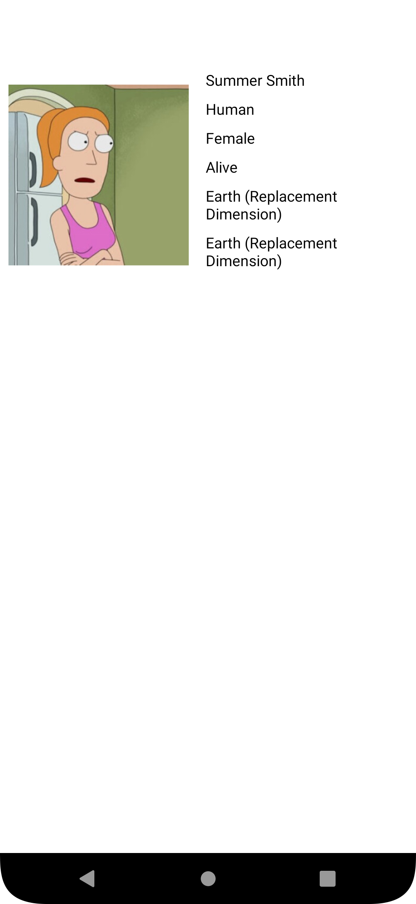
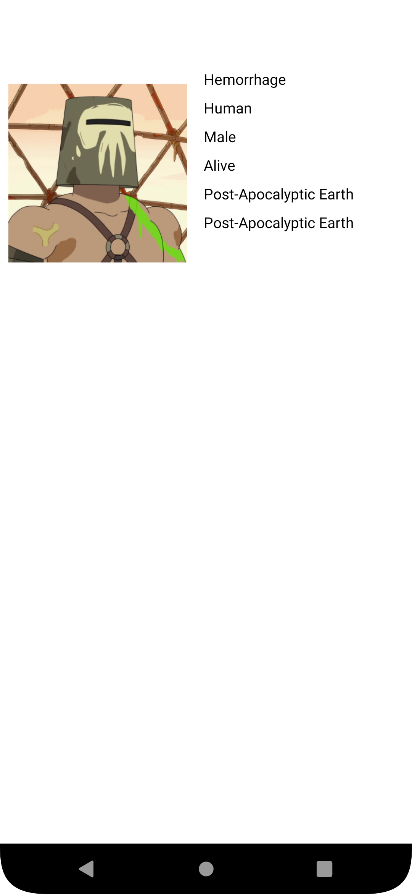
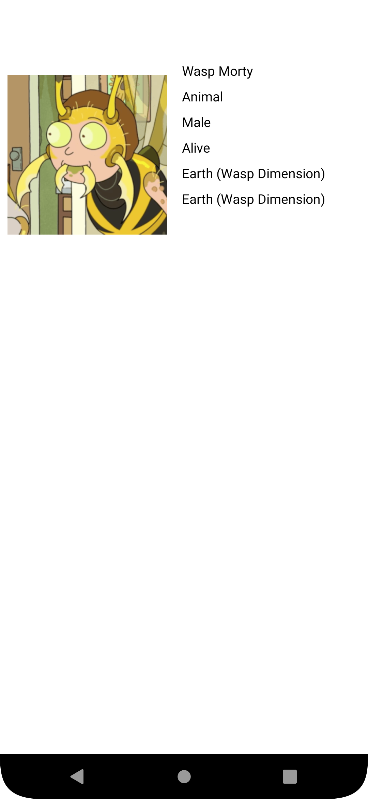

<p align = "center">МИНИСТЕРСТВО НАУКИ И ВЫСШЕГО ОБРАЗОВАНИЯ<br>
РОССИЙСКОЙ ФЕДЕРАЦИИ<br>
ФЕДЕРАЛЬНОЕ ГОСУДАРСТВЕННОЕ БЮДЖЕТНОЕ<br>
ОБРАЗОВАТЕЛЬНОЕ УЧРЕЖДЕНИЕ ВЫСШЕГО ОБРАЗОВАНИЯ<br>
«САХАЛИНСКИЙ ГОСУДАРСТВЕННЫЙ УНИВЕРСИТЕТ»</p>
<br><br><br><br><br><br>
<p align = "center">Институт естественных наук и техносферной безопасности<br>Кафедра информатики<br>Григораш Алексей Владимирович</p>
<br><br><br>
<p align = "center">Лабораторная работа № 12<br><strong>«Каталог персонажей»
</strong><br>01.03.02 Прикладная математика и информатика</p>
<br><br><br><br><br><br><br><br><br><br><br><br>
<p align = "right">Научный руководитель<br>
Соболев Евгений Игоревич</p>
<br><br><br>
<p align = "center">г. Южно-Сахалинск<br>2023 г.</p>
<br><br><br><br><br><br><br><br>

## Введение:
**Android Studio** — интегрированная среда разработки производства Google, с помощью которой разработчикам становятся доступны инструменты для создания приложений на платформе Android OS


## Задачи:

Требуется разработать мобильное приложение на Kotlin для поиска информации о персонажах из вселенной Рика и Морти. Нужные вам данные о персонажах можно взять [тут](https://rickandmortyapi.com/).

ФУНКЦИОНАЛЬНЫЕ ТРЕБОВАНИЯ 1:

- Экран с поисковой строкой;

- Отображение информации о персонаже (имя, раса, пол, статус);

- Вся информация о персонажах задаётся внутри программы.

Может пригодиться: пример организации данных. [пример организации данных](https://pastebin.com/pCiLJ9qt)

ФУНКЦИОНАЛЬНЫЕ ТРЕБОВАНИЯ 2:

- Отдельный экран с информацией о персонаже;

- Отображение расширенной информации о персонаже (изображение, родная планета, местоположение).

- Вся информация о персонажах задается внутри программы.

ФУНКЦИОНАЛЬНЫЕ ТРЕБОВАНИЯ 3:

- Использовать [RickAndMortyAPI](https://rickandmortyapi.com/) для поддержания актуальности информации о персонажах.


## Решение:

<div align="center">
    
    
    
    
</div>

### MainActivity.kt:
```kt
package com.example.rickandmorty

import android.annotation.SuppressLint
import android.content.Intent
import androidx.appcompat.app.AppCompatActivity
import android.os.Bundle
import android.widget.*
import okhttp3.OkHttpClient
import okhttp3.Request
import org.json.JSONObject
import java.util.*


class MainActivity : AppCompatActivity() {
    private lateinit var searchButton: ImageButton
    private lateinit var searchTextView: AutoCompleteTextView


    override fun onCreate(savedInstanceState: Bundle?) {
        super.onCreate(savedInstanceState)
        setContentView(R.layout.activity_main)


        searchButton = findViewById(R.id.search_button)
        searchTextView = findViewById(R.id.search_text_view)

        GetCharacters()


        searchButton.setOnClickListener{
            var isThere: Boolean = false
            Characters.list.forEach{
                if (it.name.equals(searchTextView.text.toString(), ignoreCase = true))
                    isThere = true
            }


            if (searchTextView.text.isNotEmpty() && isThere){
                Characters.searchName = searchTextView.text.toString()
                startActivity(Intent(this, CharacterFragment::class.java))
            }
            else Toast.makeText(this, "Full name please", Toast.LENGTH_LONG).show()

        }
        
    }


    @SuppressLint("SetTextI18n")
    private fun GetCharacters() {
        val client = OkHttpClient()
        val request = Request.Builder().url("https://rickandmortyapi.com/api/character/").build()

        Thread{
            val json = client.newCall(request).execute()
                .use { response -> JSONObject(response.body!!.string()) }
            if(json.has("error")){
                runOnUiThread() {
                    Toast.makeText(this, json.getString("error"), Toast.LENGTH_LONG).show()
                }
            } else {

                val pages = json.getJSONObject("info").getInt("pages")

                for (i in 0 until pages){
                    GetPages(i)
                }

            }

        }.start()

    }

    private fun GetPages(page: Int){
        val client = OkHttpClient()
        val request = Request.Builder().url("https://rickandmortyapi.com/api/character/?page=$page").build()

        Thread{
            val json = client.newCall(request).execute()
                .use { response -> JSONObject(response.body!!.string()) }
            if(json.has("error")){
                runOnUiThread() {
                    Toast.makeText(this, json.getString("error"), Toast.LENGTH_SHORT).show()
                }
            } else {

                val results = json.getJSONArray("results")

                for (i in 1 until results.length()-1) {

                    val character = results.getJSONObject(i)

                    runOnUiThread() {
                        Characters.list.add(
                            Character(
                                id = character.getInt("id"),
                                image = character.getString("image"),
                                name = character.getString("name").capitalize(),
                                species = character.getString("species").capitalize(),
                                gender = character.getString("gender").capitalize(),
                                status = character.getString("status").capitalize(),
                                origin = character.getJSONObject("origin").getString("name"),
                                location = character.getJSONObject("location").getString("name")
                            )
                        )
                    }

                }

            }

        }.start()

    }

}
```

### CharacterFragment.kt
```kt
package com.example.rickandmorty

import android.os.Bundle
import android.widget.ImageView
import android.widget.TextView
import androidx.appcompat.app.AppCompatActivity
import coil.load


class CharacterFragment: AppCompatActivity() {
    private lateinit var imageView: ImageView
    private lateinit var nameTextView: TextView
    private lateinit var speciesTextView: TextView
    private lateinit var genderTextView: TextView
    private lateinit var statusTextView: TextView
    private lateinit var originTextView: TextView
    private lateinit var locationTextView: TextView
    private lateinit var searchName: String

    override fun onCreate(savedInstanceState: Bundle?) {
        super.onCreate(savedInstanceState)
        setContentView(R.layout.list_item_character )

        imageView = findViewById(R.id.imageView)
        nameTextView = findViewById(R.id.name)
        speciesTextView = findViewById(R.id.species)
        genderTextView = findViewById(R.id.gender)
        statusTextView = findViewById(R.id.status)
        originTextView = findViewById(R.id.origin)
        locationTextView = findViewById(R.id.location)

        searchName = com.example.rickandmorty.Characters.searchName

        val character = Characters.list.find {
            it.name.contentEquals(searchName, ignoreCase = true)

        }

        imageView.load(character?.image)
        nameTextView.setText(character?.name)
        speciesTextView.setText(character?.species)
        genderTextView.setText(character?.gender)
        statusTextView.setText(character?.status)
        originTextView.setText(character?.origin)
        locationTextView.setText(character?.location)

    }

}
```

### Character.kt
```kt
package com.example.rickandmorty

import androidx.lifecycle.ViewModel

data class Character(var id: Int, var image: String, var name: String, var species: String, var gender: String, var status: String, var origin: String, var location: String)

class Characters : ViewModel(){
    companion object {
        var list = mutableListOf<com.example.rickandmorty.Character>()
        var searchName = ""
    }
}
```
## Вывод:
В ходе выполнения задач изучил RickAndMortyApi и использовал его 